## Abstract

This CIP proposes an architecture for "hoarding nodes" - specialized network participants that collect and preserve data about blocks, transactions, and network events that are typically discarded by normal Cardano nodes. Hoarding nodes aim to capture evidence of protocol violations, network anomalies, and consensus conflicts for research, security analysis, and network health monitoring purposes.

## Motivation

### The Problem

Normal Cardano nodes are designed to efficiently maintain consensus by discarding "problematic" data that doesn't contribute to the canonical chain. This includes:

- **Orphaned blocks**: Valid blocks that lost fork races
- **Equivocating blocks**: Multiple blocks produced by the same slot leader for the same slot
- **Invalid blocks**: Blocks that fail validation (invalid signatures, incorrect slot leadership, etc.)
- **Late/out-of-order blocks**: Blocks that arrive too late or in wrong sequence
- **Rejected transactions**: Transactions that fail mempool validation
- **Rollback data**: Information about chain reorganizations

While this design ensures network efficiency, it creates a significant gap for researchers, security analysts, and network operators who need visibility into:

1. **Security threats**: Evidence of attempted attacks or protocol violations
2. **Network health**: Understanding why forks occur and how they're resolved
3. **Consensus behavior**: Real-time dynamics of the consensus process
4. **Peer behavior**: Identifying misbehaving or misconfigured nodes

### Current Limitations

Existing tools like block explorers and node monitoring only show the "final" canonical state. Network researchers currently have no standardized way to:

- Collect evidence of equivocation or other protocol violations
- Study fork resolution dynamics in real-time
- Analyze why certain blocks or transactions are rejected
- Track the propagation and timing of network events

## Specification

### Architecture Overview

The hoarding node system consists of six main components:

1. **Hoarding Processes** - Lightweight processes that connect to Cardano peers and collect network data
2. **Shared Database** - Centralized PostgreSQL storage with deduplication and correlation capabilities
3. **Repository Service** - Data access abstraction layer providing APIs for all database operations
4. **Full Cardano Node** - Standard node providing validation services and canonical chain state
5. **HTTP Analytics API** - REST endpoints for researchers and monitoring tools to access collected data
6. **Background Workers** - Automated data processing for classification, archival, and cleanup

```mermaid
graph TD
    %% Network Input

    %% Data Access Subgraph
    subgraph Access ["🔍 Data Access Layer"]
        E[HTTP Analytics API<br/>- REST endpoints<br/>- Data export]
    end

    A[Cardano Network Peers]

    %% Data Collection Subgraph
    subgraph Collection ["🔄 Data Collection Layer"]
        B1[Hoarding Process 1<br/>Peers: 1-20]
        B2[Hoarding Process 2<br/>Peers: 21-40]
        BN[Hoarding Process N<br/>Peers: X-Y]
    end

    %% Data Storage Subgraph
    subgraph Storage ["💾 Data Storage Layer"]
        R((Repository Service<br/>- Data access APIs<br/>- Connection pooling<br/>- Caching & optimization))
        C[(Shared Database<br/>PostgreSQL<br/>- Blocks, transactions, violations<br/>- Deduplication and correlation)]
    end

    %% Data Processing Subgraph
    subgraph Processing ["⚙️ Data Processing Layer"]
        D1[Classification Worker<br/>- Validate blocks/txs<br/>- Detect violations<br/>- Mark for eviction]
        D2[Eviction Worker<br/>- Archive data<br/>- Delete marked data<br/>- Cleanup]
    end

    %% External Components
    F(External Consumers<br/>- Research tools<br/>- Monitoring<br/>- Security analysis<br/>- Academic studies)
    G{{Full Cardano Node<br/>- Block validation<br/>- Transaction verification<br/>- State queries}}

    %% Network Protocol Connections
    A -.->|Node-to-Node Protocol| B1
    A -.->|Node-to-Node Protocol| B2
    A -.->|Node-to-Node Protocol| BN

    %% Data Flow Connections
    B1 -->|store blocks/txs| R
    B2 -->|store blocks/txs| R
    BN -->|store blocks/txs| R

    R <-->|read/write data| C

    R -->|get unprocessed data| D1
    D1 -->|write classifications| R
    R -->|get marked data| D2
    D2 -->|delete/archive| R
    R -->|analytics queries| E

    E -->|HTTP| F

    %% Validation and Network Connections
    D1 <-.->|validation queries<br/>Node-to-Client| G
    G -.->|relay blocks/txs<br/>Node-to-Node| A

    %% Enhanced Styling
    classDef collectionClass fill:#e3f2fd,stroke:#1976d2,stroke-width:2px
    classDef storageClass fill:#f1f8e9,stroke:#388e3c,stroke-width:2px
    classDef processingClass fill:#f3e5f5,stroke:#7b1fa2,stroke-width:2px
    classDef accessClass fill:#fff9c4,stroke:#f57f17,stroke-width:2px
    classDef externalClass fill:#fff3e0,stroke:#f57c00,stroke-width:2px
    classDef consumerClass fill:#fce4ec,stroke:#c2185b,stroke-width:2px
    classDef networkClass fill:#f9fbe7,stroke:#689f38,stroke-width:2px

    class B1,B2,BN collectionClass
    class R,C storageClass
    class D1,D2 processingClass
    class E accessClass
    class G externalClass
    class F consumerClass
    class A networkClass
```



### Component Specifications

#### 1. Hoarding Processes

##### Purpose

Lightweight processes that establish Node-to-Node protocol connections with Cardano peers.

##### Configuration
- `N = ⌈total_known_peers / max_connections_per_process⌉`
- Each process maintains long-lived connections to assigned peers
- Default `max_connections_per_process = 20`

##### Behavior
- **Data collection**: Store all received ChainSync, BlockFetch, and TxSubmission messages via Repository Service APIs
- **Observation only**: Hoarding processes are passive observers; they do not forward blocks or transactions (the separate full Cardano node handles network relaying duties)
- **Peer discovery and coverage expansion**:
  - Bootstrap from known relays (initial seed peers)
  - Use Peer Sharing Protocol to discover additional peers during operation
  - Store all discovered peers in database (PEERS table) for persistent tracking
  - Periodically spawn new hoarding processes connecting to previously undiscovered peers
  - Iterative expansion: new processes discover more peers, expanding network coverage over time
  - This strategy maximizes visibility into different network segments and increases chances of observing invalid data
- **Connection management**:
  - No redistribution when peers drop (to avoid reorganization overhead)
  - Dynamic addition of newly discovered peers to database
  - Graceful handling of connection failures

##### Protocol-Specific Data Collection

###### ChainSync Protocol
- **Block Headers**: Collect all announced block headers regardless of validation status
- **Chain Updates**: Record `RollForward` and `RollBackward` messages with timestamps
- **Intersection Points**: Track where different peers' chain views diverge
- **Tip Updates**: Monitor how chain tip announcements propagate across peers
- **Rollback Events**: Capture chain reorganizations with depth and timing information

###### BlockFetch Protocol
- **Block Requests**: Log which blocks are requested from which peers
- **Block Responses**: Store complete block bodies including failed/timed-out requests
- **Fetch Failures**: Record blocks that couldn't be retrieved (network errors, peer disconnections)
- **Streaming Behavior**: Track batched block fetch patterns and peer responsiveness
- **Block Validation**: Correlate fetched blocks with subsequent validation results

###### TxSubmission Protocol
- **Transaction Announcements**: Capture all transaction IDs announced by peers
- **Transaction Bodies**: Store full transaction content when available
- **Mempool Rejections**: Record transactions rejected with rejection reasons
- **Propagation Patterns**: Track how transactions spread through the network
- **Duplicate Submissions**: Identify transactions submitted by multiple peers

###### Peer Sharing Protocol (if implemented)
- **Peer Advertisements**: Collect peer address announcements
- **Network Topology**: Build connectivity graphs from peer sharing data
- **Relay Preferences**: Track which peers are recommended as relays
- **Geographic Distribution**: Analyze peer distribution patterns

##### Storage Bounds

To prevent unbounded storage consumption from adversarial behavior, hoarding processes enforce limits on data collection:

**Equivocation Protection**:
- **Problem**: An adversarial pool that wins slot leadership could produce unlimited blocks for a single slot (equivocation attack)
- **Solution**: Limit storage per `(slot_number, pool_id)` pair
- **Default**: `max_blocks_per_slot_pool = 10`
- **Rationale**:
  - First 2 equivocating blocks prove the protocol violation
  - Storing up to 10 provides redundancy and pattern analysis capability
  - Beyond 10, additional equivocations provide diminishing research value
  - This bounds storage even if an adversarial pool produces thousands of blocks per slot

**Implementation**: When a hoarding process receives a block for a `(slot, pool)` combination that already has the maximum number of stored blocks, it should:
1. Log the attempt for metrics (to track attack magnitude)
2. Optionally update a counter for that slot/pool combination
3. Discard the block without storing

##### Open Considerations

###### Data Deduplication at Collection Level
- Should hoarding processes perform immediate hash-based deduplication before calling Repository Service APIs to reduce storage load?
- How should batching be implemented to balance memory usage vs. Repository Service call efficiency?
- What memory bounds and backpressure mechanisms are needed for queued data awaiting storage?

###### Security and DoS Prevention
- What rate limiting mechanisms should be applied per-peer and globally to prevent resource exhaustion?
- How should the system detect and handle peers sending malformed or excessive data?
- What resource bounds (memory, CPU, disk I/O) should be enforced per hoarding process?
- Should there be reputation scoring to automatically disconnect problematic peers?

###### Network Citizenship and Stealth Operation
- What forwarding rules ensure hoarding nodes contribute positively to network health?
- How can connection patterns and timing be randomized to avoid detection as monitoring infrastructure?
- What protocol compliance checks are needed to maintain compatibility with regular nodes?
- Should there be graceful degradation when peers start rejecting connections?

###### Configuration and Performance
- What parameters should be tunable (connection counts, timeouts, batch sizes, retention policies)?
- How should the system monitor its own health and performance impact on the network?
- What logging and metrics are needed for operational visibility without compromising stealth?
- How should the system scale with network growth and increasing peer counts?

###### Peer Opt-out Mechanism
- How can stake pool operators opt-out of being monitored by hoarding nodes if they choose to?
- Should this be configuration-based (denylist file), or does it need a more dynamic mechanism (API, database)?
- Configuration files require service restarts and lack flexibility - is there a better approach?
- Is there a way for peers to signal opt-out preference in-protocol, or must it remain out-of-band?
- What are the ethical and community governance considerations around respecting opt-out requests?
- Should there be a standardized opt-out registry or does each hoarding node operator handle this independently?
- **Note**: Any opt-out mechanism could be abused by adversarial participants to avoid monitoring and hide protocol violations. This creates a fundamental tension between respecting operator preferences and ensuring comprehensive security monitoring.

#### 2. Shared Database

**Purpose**: Centralized storage for all collected data with deduplication and correlation capabilities.

**Terminology**: The schema tracks two distinct types of identities:
- **Stake Pool (`pool_id`)**: A registered entity that produces blocks when it wins slot leadership. The pool signs blocks with its keys. Multiple blocks from the same pool for the same slot indicate equivocation.
- **Network Node / Peer (`peer_id`)**: A server running cardano-node that relays blocks and transactions through the network. A single stake pool typically operates multiple nodes (block producer + relays).

The distinction: pools **produce** blocks, peers **relay** blocks. The same block may be relayed by many peers but was produced by exactly one pool.

**Schema Requirements**:


**Deduplication Strategy**:
- **Content Storage**: Store unique content once in `blocks`/`transactions` tables using hash as primary key
- **Source Tracking**: Record every peer that sends the content in separate `*_sources` tables
- **Timing Preservation**: Maintain `received_at` timestamp for each peer source
- **Propagation Analysis**: Enable analysis of how content propagates through the network
- **Peer Behavior**: Track which peers send duplicate content and timing patterns

**Connection State Management**:
- **Runtime tracking**: Connection state (which peers are currently connected) is maintained in-memory by each hoarding process, not in the database
- **Rationale**: Avoids stale state from crashed processes, eliminates constant database updates on connect/disconnect, prevents race conditions
- **Process spawning**: When spawning new hoarding processes, query the PEERS table and filter out peers that existing processes report as connected (via runtime coordination/reporting mechanism)

**Future Extension - Connection History**:
The system could be extended with a `CONNECTIONS` table for historical connection analysis:
```
CONNECTIONS {
    int id PK
    string peer_id FK
    timestamp connected_at
    timestamp disconnected_at (nullable)
    string disconnection_reason
}
```
This would enable analysis of peer reliability, connection duration patterns, and network topology changes over time. However, this is not required for operational peer selection.

#### 3. Repository Service

**Purpose**: Data access abstraction layer that provides clean, consistent interfaces for all database operations while encapsulating complexity.

**Architecture**: RESTful internal service with well-defined APIs for data ingestion, querying, and management.

**Key Benefits**:
- **Schema Abstraction**: Components don't need to know database schema details
- **Connection Management**: Centralized connection pooling and transaction handling
- **Performance Optimization**: Intelligent caching, query optimization, and batch operations
- **Consistency**: Uniform error handling and data validation across all operations
- **Maintainability**: Single point for data access logic changes

**API Categories**:

**Data Ingestion APIs**:
```haskell
-- Store network data with automatic deduplication
storeBlock :: Block -> PeerID -> Timestamp -> IO BlockResult
storeTransaction :: Transaction -> PeerID -> Timestamp -> IO TxResult
storeViolation :: Violation -> Evidence -> IO ViolationID
```

**Violation Detection APIs**:
```haskell
-- Query for different types of violations
getEquivocations :: SlotRange -> IO [Equivocation]
getOrphanedBlocks :: ValidationCriteria -> IO [OrphanedBlock]
getInvalidBlocks :: ValidationReason -> TimeRange -> IO [InvalidBlock]
getTimingAnomalies :: DelayThreshold -> IO [TimingAnomaly]
```

**Data Classification APIs**:
```haskell
-- Background worker operations
getUnprocessedBlocks :: BatchSize -> IO [UnprocessedBlock]
classifyBlock :: BlockHash -> Classification -> Metadata -> IO ()
markForEviction :: [BlockHash] -> EvictionPolicy -> IO ()
```

**Analytics APIs**:
```haskell
-- Support HTTP API queries
getBlockSources :: BlockHash -> IO [PeerSource]
getPeerBehavior :: PeerID -> TimeRange -> IO PeerStats
getNetworkMetrics :: MetricType -> TimeRange -> IO [Metric]
exportViolations :: ExportFormat -> FilterCriteria -> IO ExportResult
```

**Configuration**:
- **Connection Pool**: Configurable database connection limits and timeouts
- **Caching Strategy**: In-memory caching for frequently accessed data
- **Rate Limiting**: API call limits to prevent resource exhaustion
- **Batch Processing**: Configurable batch sizes for bulk operations

#### 4. Full Cardano Node Integration

**Purpose**: Provide validation services to background workers and handle network relaying duties for the hoarding system.

**Responsibilities**:
- **Network Relay**: Connects to Cardano network and relays valid blocks/transactions (maintains network citizenship)
- **Validation Service**: Provides Node-to-Client queries for background workers to classify collected data
- **Canonical Chain State**: Maintains full ledger state to identify which blocks are on the canonical chain

**Configuration**:
- Standard cardano-node with normal network connectivity
- Maintains full ledger state for validation queries
- Background workers connect via Node-to-Client protocol for classification tasks

**Node-to-Client Protocol Extensions** (proposed):
```haskell
-- New queries for validation offloading
data HoardingQuery =
    ValidateBlock Block
  | ValidateTransaction Tx
  | CheckSlotLeadership Slot PoolId
  | GetCanonicalBlockAt Slot
  | GetRollbackInfo Point Point

-- Enhanced responses with detailed reasoning
data ValidationResult = ValidationResult
  { isValid :: Bool
  , reason :: ValidationReason
  , detailedError :: Maybe ValidationError
  , consensusView :: ConsensusState
  }
```

#### 5. HTTP Analytics API

**Purpose**: Provide standardized access to collected hoarding data for researchers, security analysts, and monitoring tools.

**Architecture**: HTTP API that queries data through Repository Service APIs, providing JSON responses and OpenAPI documentation.

**Authentication**: Configurable authentication methods (API keys, OAuth2, or public read-only access for research deployments).

**Endpoint Categories**:

##### Violation Analysis Endpoints

**Equivocation Detection**
```http
GET /api/v1/equivocations
Query Parameters:
  - slot_range: "1000000-1001000" (optional)
  - pool_id: "pool1abc..." (optional)
  - limit: 100 (default: 50, max: 1000)
  - offset: 0 (for pagination)
```

<details>
<summary>View Response Example</summary>

```json
{
  "equivocations": [
    {
      "slot_number": 1000500,
      "pool_id": "pool1abc...",
      "block_hashes": ["a1b2c3...", "d4e5f6..."],
      "detected_at": "2024-09-16T14:30:15Z",
      "evidence": {
        "signatures_valid": true,
        "vrf_proofs_valid": true,
        "received_from_peers": ["peer1", "peer2"]
      }
    }
  ],
  "pagination": {
    "total": 1,
    "offset": 0,
    "limit": 50
  }
}
```
</details>

**Orphaned Blocks**
```http
GET /api/v1/orphaned-blocks
Query Parameters:
  - slot_range: "1000000-1001000"
  - reason: "timing" | "fork_resolution" | "late_arrival"
  - limit, offset (pagination)
```

**Invalid Blocks**
```http
GET /api/v1/invalid-blocks
Query Parameters:
  - validation_reason: "invalid_signature" | "wrong_leader" | "invalid_vrf"
  - slot_range, limit, offset
```

**Late Blocks**
```http
GET /api/v1/late-blocks
Query Parameters:
  - min_delay_seconds: 20 (blocks arriving >20s after slot time)
  - slot_range, limit, offset
```

##### Network Health Endpoints

**Fork Analysis**
```http
GET /api/v1/forks
Query Parameters:
  - slot_range: "1000000-1001000"
  - min_depth: 2 (minimum fork depth)
  - resolution_status: "resolved" | "ongoing"
```

<details>
<summary>View Response Example</summary>

```json
{
  "forks": [
    {
      "fork_point": {
        "slot": 1000500,
        "block_hash": "abc123..."
      },
      "branches": [
        {
          "blocks": ["def456...", "ghi789..."],
          "length": 2,
          "is_canonical": true
        },
        {
          "blocks": ["jkl012..."],
          "length": 1,
          "is_canonical": false
        }
      ],
      "resolution_time": "2024-09-16T14:32:45Z",
      "duration_seconds": 150
    }
  ]
}
```
</details>

**Rollback Events**
```http
GET /api/v1/rollbacks
Query Parameters:
  - min_depth: 1 (minimum rollback depth)
  - time_range: ISO 8601 range
```

**Peer Behavior Analysis**
```http
GET /api/v1/peer-behavior
Query Parameters:
  - peer_id: "12D3KooW..." (specific peer)
  - violation_type: "equivocation" | "invalid_blocks" | "late_blocks"
  - time_range
```

<details>
<summary>View Response Example</summary>

```json
{
  "peer_stats": [
    {
      "peer_id": "12D3KooWABC...",
      "total_blocks_sent": 1500,
      "invalid_blocks_sent": 5,
      "equivocations_sent": 2,
      "avg_block_delay_seconds": 12.5,
      "reputation_score": 0.97,
      "first_seen": "2024-09-15T00:00:00Z",
      "last_seen": "2024-09-16T15:00:00Z"
    }
  ]
}
```
</details>

**Network Timing Analysis**
```http
GET /api/v1/network-timing
Query Parameters:
  - slot_range
  - metric: "propagation_delay" | "validation_time" | "fork_resolution_time"
```

##### Consensus Analysis Endpoints

**Slot Battles (Multiple blocks per slot)**
```http
GET /api/v1/slot-battles
Query Parameters:
  - slot_range
  - min_contestants: 2 (minimum number of competing blocks)
```

**Canonical vs Observed Chain Differences**
```http
GET /api/v1/consensus-view
Query Parameters:
  - slot_range
  - include_metadata: true|false
```

**Validation Statistics**
```http
GET /api/v1/validation-stats
Query Parameters:
  - time_range
  - group_by: "hour" | "day" | "slot_range"
```

<details>
<summary>View Response Example</summary>

```json
{
  "validation_summary": {
    "total_blocks_processed": 10000,
    "valid_blocks": 9850,
    "invalid_blocks": 150,
    "validation_breakdown": {
      "invalid_signature": 45,
      "wrong_leader": 32,
      "invalid_vrf": 28,
      "other": 45
    },
    "avg_validation_time_ms": 15.2
  }
}
```
</details>

##### Data Export Endpoints

**Detailed Block Information**
```http
GET /api/v1/blocks/{block_hash}
Response includes: Full block data, validation status, peer sources, timing info
```

**Transaction Lifecycle**
```http
GET /api/v1/transactions/{tx_hash}
Response includes: Transaction data, mempool history, inclusion status
```

**Bulk Export for Research**
```http
GET /api/v1/export/violations
Query Parameters:
  - format: "json" | "csv" | "parquet"
  - date_range
  - violation_types: comma-separated list
```

**Historical Data Download**
```http
GET /api/v1/export/historical
Query Parameters:
  - slot_range
  - data_types: "blocks" | "transactions" | "violations" | "all"
  - compression: "gzip" | "none"
```

**Rate Limiting**: All endpoints implement rate limiting to prevent abuse while allowing legitimate research usage.

**Caching**: Frequently accessed data is cached with appropriate TTL values to improve response times.

**Data Retention**: API provides access to configurable retention periods (e.g., 30 days for high-frequency data, 1 year for violation summaries).

#### 6. Background Workers

**Purpose**: Automated data processing to manage storage and focus on valuable violations while discarding routine data.

**Data Processing Worker**: Periodically queries unprocessed data via Repository Service APIs and decides whether to:
- **Keep/Enrich**: Mark data as valuable and add analysis metadata (violation type, research category, peer reputation impact)
- **Discard/Archive**: Remove routine data or compress to summary statistics

**Data Classification**:

**Keep/Enrich**:
- Protocol violations (equivocating blocks, invalid leadership)
- Consensus conflicts (orphaned blocks, forks, rollbacks)  
- Network anomalies (late blocks, timing irregularities)
- Attack evidence (coordinated violations, peer misbehavior)

**Discard/Archive**:
- Canonical chain blocks (available elsewhere)
- Redundant transaction data (transactions in canonical blocks)

**Configuration**:
```yaml
background_workers:
  processing_schedule: "*/10 * * * *"  # Every 10 minutes
  batch_size: 1000                     # Rows processed per batch
  retention_canonical: "7d"            # Keep canonical blocks briefly
  retention_violations: "permanent"    # Keep violations permanently
```

### Data Collection Strategies

#### Violation Detection Algorithms

**Equivocation Detection**:
1. **Data Indexing**: Maintain an index of blocks by (slot_number, pool_id)
2. **Conflict Detection**: For each new block, check if another block exists for the same slot+pool combination
3. **Signature Verification**: Validate that both blocks are properly signed by the claimed pool
4. **Evidence Collection**: Store both conflicting blocks with metadata about detection time and source peers
5. **Pattern Analysis**: Track repeated equivocations from the same pool for reputation scoring

**Orphan Analysis**:
1. **Chain Tracking**: Maintain a representation of the canonical chain tip as reported by the full node
2. **Validation Status**: For each collected block, query the full node to determine if it's in the canonical chain
3. **Fork Detection**: Identify blocks that were valid but didn't become canonical due to chain reorganization
4. **Temporal Classification**: Distinguish between recent orphans (may still become canonical) and settled orphans
5. **Causal Analysis**: Correlate orphaned blocks with network events (timing, peer behavior, competing blocks)

**Timing Analysis**:
1. **Slot Time Calculation**: Convert slot numbers to expected timestamps using network parameters
2. **Arrival Time Recording**: Record precise arrival timestamps for all network messages
3. **Delay Computation**: Calculate the difference between expected slot time and actual arrival time
4. **Threshold Detection**: Flag blocks arriving significantly late (configurable threshold, e.g., >20 seconds)
5. **Network Health Correlation**: Correlate timing anomalies with peer behavior and network partition events

**Invalid Block Analysis**:
1. **Validation Attempt**: Submit all received blocks to the full node for validation
2. **Error Classification**: Categorize validation failures (invalid signature, wrong leader, malformed data, etc.)
3. **Attack Pattern Detection**: Identify systematic invalid block patterns that may indicate coordinated attacks
4. **Peer Attribution**: Track which peers send invalid blocks to build reputation profiles
5. **False Positive Filtering**: Distinguish between genuine attacks and benign misconfigurations

### Network Health Safeguards

To ensure the hoarding system doesn't negatively impact network health:

1. **Separation of Concerns**:
   - Hoarding processes act as passive observers (do not forward messages)
   - Full Cardano node handles all network relaying duties
   - This maintains normal network citizenship without compromising data collection
2. **Rate Limiting**: Implement connection and request rate limits to avoid overwhelming peers
3. **Graceful Degradation**: Reduce activity if peers start rejecting connections
4. **Transparent Observation**: Hoarding processes behave like normal peers (request blocks, stay synchronized) but don't relay data

## Rationale

### Design Decisions

**Multiple Processes vs Single Process**:
- **Choice**: N separate processes
- **Rationale**: Distributes connection load, provides fault isolation, enables parallel processing
- **Alternative**: Single process with async I/O (rejected due to complexity and single point of failure)

**Shared Database vs Distributed Storage**:
- **Choice**: Centralized PostgreSQL
- **Rationale**: Enables complex correlation queries, ACID transactions, mature tooling
- **Alternative**: Distributed database (rejected due to added complexity for initial implementation)

**Full Node Integration vs External Validation**:
- **Choice**: Dedicated cardano-node for validation
- **Rationale**: Leverages existing validation logic, ensures consistency with network consensus
- **Alternative**: Reimplementing validation (rejected due to maintenance burden and accuracy concerns)

**Store-All-Then-Filter vs Selective Storage**:
- **Choice**: Store all received blocks/transactions, then classify and evict via background workers
- **Rationale**:
  - Simpler collection logic - hoarding processes don't need validation queries or canonical chain state
  - No dependency on full node availability during collection (higher reliability)
  - Enables post-hoc analysis of data that might be classified differently as criteria evolve
  - Separates concerns: collection is fast and stateless, classification can be slower and stateful
- **Storage Trade-off**: Increased storage costs are temporary - only until background workers classify and evict canonical/routine data. The additional storage is proportional to the processing lag (e.g., if classification runs every 10 minutes, roughly 10 minutes of canonical blocks are stored temporarily).
- **Alternative**: Only store non-canonical data (as proposed in original proposal) - rejected due to increased complexity and tight coupling.
- **Note**: This differs from the original proposal which suggested storing only non-canonical data by default.

**Outbound-Only vs Bidirectional Connections**:
- **Choice**: Hoarding processes only make outbound connections (do not accept inbound)
- **Rationale**:
  - Node-to-Node protocol connections are bidirectional regardless of who initiated the TCP connection - peers can push both blocks and transactions over connections we initiate
  - Broad peer discovery via peer sharing provides sufficient network coverage, including connections to potentially malicious/buggy nodes that send invalid data
  - Simpler deployment: no port forwarding, public IP requirements, or inbound connection handling
  - Lower attack surface: cannot be targeted with inbound connection spam
- **Alternative**: Accept inbound connections (as mentioned in original proposal) - deemed unnecessary since outbound connections are sufficient for comprehensive monitoring.

**No Validation in Hoarding Processes**:
- **Choice**: Hoarding processes perform no validation; all classification and validation is offloaded to background workers querying the full node
- **Rationale**:
  - Keeps hoarding processes lightweight, stateless, and focused on reliable data collection
  - Validation requires access to full ledger state, stake distribution, and protocol parameters—complexity better suited to background workers
  - Hoarding processes don't make forwarding decisions (full node handles relaying), so real-time validation provides no benefit
  - Batch validation by background workers is sufficient; real-time violation detection is not required
  - Separation of concerns: fast collection vs. slower, stateful classification
- **Alternative**: Progressive validation where hoarding processes eventually perform header or full block validation (as suggested in original proposal)—rejected as it adds complexity without meaningful benefit given the passive observer architecture.

### Trade-offs

**Storage vs Network Load**:
- Storing all data increases storage requirements significantly
- But provides complete visibility into network behavior
- Mitigation: Configurable retention policies, data compression

**Collection Completeness vs Network Health**:
- Aggressive collection might be seen as adversarial
- But transparent relay behavior maintains network citizenship
- Mitigation: Rate limiting, graceful degradation, community coordination

## Path to Active

### Acceptance Criteria

1. **Reference Implementation**: Working implementation of all six components
2. **Performance Analysis**: Demonstration that hoarding nodes don't negatively impact network performance
3. **Security Review**: Analysis of potential attack vectors and mitigations
4. **Community Consensus**: Agreement from node operators and researchers on value and safety
5. **Documentation**: Complete operational guide and best practices

### Implementation Plan

**Phase 1: Prototype**
- Basic hoarding process with ChainSync collection
- Simple storage backend (PostgreSQL)
- Basic Repository Service with core data ingestion APIs
- Manual peer configuration
- Full node integration for validation (via background workers, not hoarding processes)

**Phase 2: Enhanced Collection**
- Full protocol coverage (ChainSync, BlockFetch, TxSubmission)
- Complete Repository Service with all API categories
- Automated peer discovery and management
- Real-time violation detection
- Basic HTTP API for violation queries
- Data processing background worker
- Performance optimization

**Phase 3: Production Readiness**
- Complete HTTP Analytics API with all endpoint categories
- API authentication and rate limiting
- Robust error handling and recovery
- Comprehensive monitoring and alerting
- Security hardening
- OpenAPI documentation

### Success Metrics

- **Data Quality**: Successful collection and verification of known protocol violations
- **Network Impact**: Negligible negative impact on network performance or consensus
- **Research Value**: Demonstrated use cases for security analysis and network research

## Copyright

This CIP is licensed under [CC-BY-4.0](https://creativecommons.org/licenses/by/4.0/legalcode).
