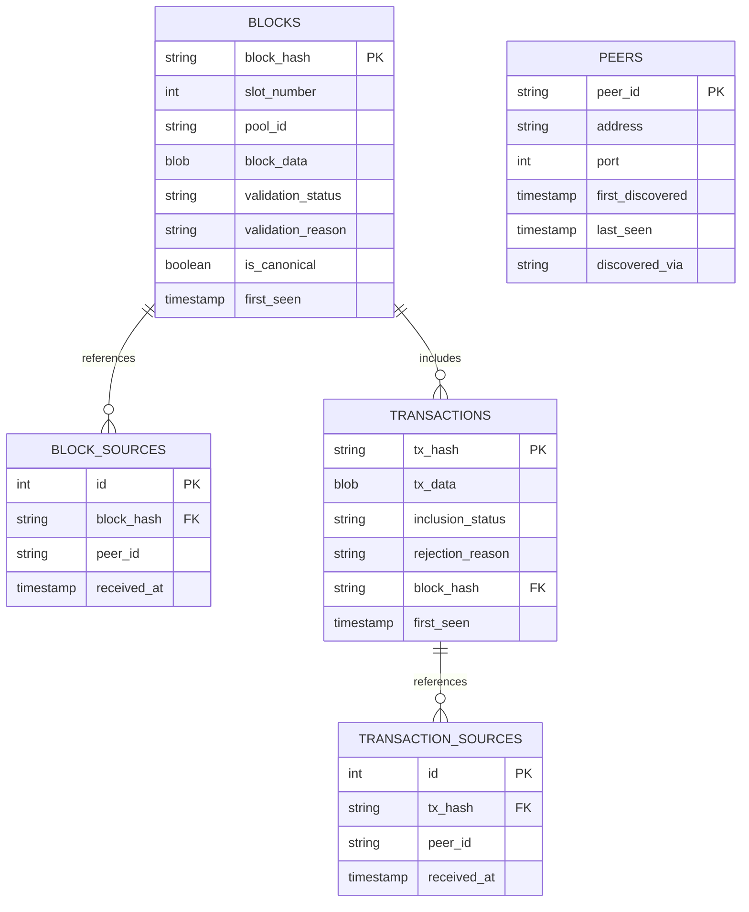

# Database Schema

Implementation reference for the hoarding node storage layer.

## Terminology

The schema tracks two distinct types of identities:

- **Stake Pool (`pool_id`)**: A registered entity that produces blocks when it wins slot leadership. The pool signs blocks with its keys. Multiple blocks from the same pool for the same slot indicate equivocation.
- **Network Node / Peer (`peer_id`)**: A server running cardano-node that relays blocks and transactions through the network. A single stake pool typically operates multiple nodes (block producer + relays).

The distinction: pools **produce** blocks, peers **relay** blocks. The same block may be relayed by many peers but was produced by exactly one pool.

## Schema

## Deduplication Strategy

- **Content Storage**: Store unique content once in `blocks`/`transactions` tables using hash as primary key
- **Source Tracking**: Record every peer that sends the content in separate `*_sources` tables
- **Timing Preservation**: Maintain `received_at` timestamp for each peer source
- **Propagation Analysis**: Enable analysis of how content propagates through the network
- **Peer Behavior**: Track which peers send duplicate content and timing patterns

## Connection State Management

- **Runtime tracking**: Connection state (which peers are currently connected) is maintained in-memory by each hoarding process, not in the database
- **Rationale**: Avoids stale state from crashed processes, eliminates constant database updates on connect/disconnect, prevents race conditions
- **Process spawning**: When spawning new hoarding processes, query the PEERS table and filter out peers that existing processes report as connected (via runtime coordination/reporting mechanism)
