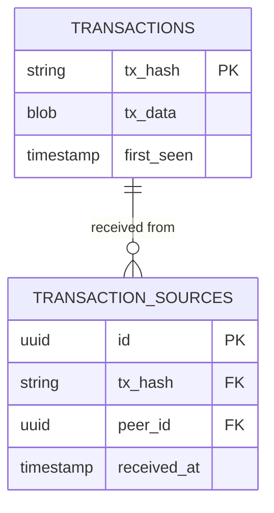

# Transaction Collection

## Related

- [proposal/embedded-consensus.md](../proposal/embedded-consensus.md) — the
  embedded ChainDB that classifies blocks and replaces the external Cardano node
- [proposal/embedded-consensus-hoard-design.md](../proposal/embedded-consensus-hoard-design.md) —
  implementation detail: how ChainDB maps onto Hoard's Component model

## Overview

Hoard collects headers and blocks by making **outbound** connections to peers
and running as the initiator side of the Node-to-Node mini-protocols.
Transaction collection requires a different approach due to a role asymmetry in
the Cardano Node-to-Node protocol.

In TxSubmission2, transactions flow from the mini-protocol **client** to the
mini-protocol **server**:

- The **client** (TCP initiator / outbound side) holds a mempool. When the
  server asks for transactions, the client replies with IDs and bodies.
- The **server** (TCP responder / inbound side) drives the exchange. It sends
  `MsgRequestTxIds*` to request transaction IDs and `MsgRequestTxs` to
  download the bodies.

Because Hoard currently uses `InitiatorOnlyDiffusionMode` and only makes
outbound connections, it runs as the TxSubmission2 **client** on every
connection. That means Hoard can only advertise its own (empty) mempool to
peers — it cannot request transactions from them. To collect transactions from
peers' mempools, Hoard must **accept inbound connections** and run TxSubmission2
as the **server**.

This proposal describes the inbound listener, the TxSubmission2 server
mini-protocol, and the storage layer needed to collect transactions.

## Background: TxSubmission2 roles

Each Node-to-Node connection runs three mini-protocols simultaneously. The role
each side plays depends on whether it is the TCP initiator (outbound) or
responder (inbound):

| Mini-Protocol | Initiator / outbound | Responder / inbound |
|---------------|----------------------|---------------------|
| ChainSync     | Client — pulls headers from peer | Server — serves headers to peer |
| BlockFetch    | Client — pulls blocks from peer  | Server — serves blocks to peer  |
| TxSubmission2 | Client — peer requests our TXs, we send them | **Server — we request peer's TXs, they send them** |

Hoard's existing outbound collectors cover the initiator column. Transaction
collection requires the responder column — specifically the TxSubmission2
server role.

### TxSubmission2 state machine

The protocol starts with the **client** sending `MsgInit`. Control then
passes to the **server** in `StIdle`:

```
StInit  [client]  →  MsgInit  →  StIdle  [server]
StIdle  [server]  →  MsgRequestTxIdsBlocking(ack, req)    →  StTxIdsBlocking  [client]
StIdle  [server]  →  MsgRequestTxIdsNonBlocking(ack, req) →  StTxIdsNonBlocking [client]
StTxIdsBlocking / StTxIdsNonBlocking  [client]  →  MsgReplyTxIds([(id, size)])  →  StIdle  [server]
StIdle  [server]  →  MsgRequestTxs([ids])  →  StTxs  [client]
StTxs  [client]   →  MsgReplyTxs([txs])   →  StIdle  [server]
StTxIdsBlocking  [client]  →  MsgDone  →  StDone
```

The **server** (Hoard on inbound connections) sends all request messages and
drives the pull loop. The **client** (the connecting peer) holds the mempool
and replies. The protocol allows at most 10 unacknowledged transaction IDs
outstanding at a time; the `ack` parameter in each `MsgRequestTxIds*` releases
slots from the previous round in FIFO order.

## Transaction flow

```
Peer A ──┐
Peer B ──┤── inbound connection ──► Hoard.Responder
Peer C ──┘                               │
                                         ├── ChainSync server (backed by ChainDB)
                                         ├── BlockFetch server (no-op stub)
                                         └── TxSubmission2 server
                                                   │
                                          TransactionReceived event
                                                   │
                                          Persistence component
                                                   │
                                          TransactionRepo → DB
```

Outbound connections are unchanged. The new inbound path runs alongside the
existing collector pipeline.

## Components

### Transaction data types

Two new modules mirror `Hoard.Data.BlockHash` and `Hoard.Data.Block`:

```haskell
-- Hoard.Data.TxHash
newtype TxHash = TxHash { getBytes :: ByteString }
    deriving stock (Eq, Ord, Show, Generic)

-- Hoard.Data.Transaction
data Transaction = Transaction
    { hash      :: TxHash
    , txData    :: Serialized CardanoTx
    , firstSeen :: UTCTime
    }
```

`CardanoTx` is a type alias in `Hoard.Types.Cardano` for the consensus-era
transaction type, mirroring the existing `CardanoBlock` alias.

### TxSubmission2 server mini-protocol

A new module `Hoard.Effects.NodeToNode.TxSubmission` implements the
TxSubmission2 **server** that runs on inbound connections. The signature mirrors
the existing mini-protocol modules:

```haskell
miniProtocol
    :: ( Pub TransactionReceived :> es
       , TransactionRepo :> es
       , ...
       )
    => TxSubmissionConfig
    -> (forall x. Eff es x -> IO x)
    -> CardanoCodecs
    -> Peer
    -> CardanoMiniProtocol
```

The server loop (Hoard has agency in `StIdle`):

1. Receive `MsgInit` from the connecting peer (peer sends first, transitions to `StIdle`).
2. Send `MsgRequestTxIdsBlocking ack req` — blocking: the peer will wait until
   it has at least one new ID to report. `ack` releases previously seen IDs;
   `req` asks for up to `min(req, 10 - outstanding)` new IDs.
3. Receive `MsgReplyTxIds [(txId, txSize)]` — the peer's available transaction
   IDs and their byte sizes.
4. Filter the list: skip IDs already in `TransactionRepo` (via `txExists`) and
   IDs whose announced size exceeds `maximumTxBodyBytes`.
5. If any IDs remain: send `MsgRequestTxs [wantedIds]`.
6. Receive `MsgReplyTxs [txBodies]` — the peer may omit bodies for transactions
   that have been committed or become invalid since they were announced.
7. Publish `TransactionReceived` for each body received.
8. Increment `ack` by the number of IDs acknowledged this round and repeat
   from step 2.

Non-blocking requests (`MsgRequestTxIdsNonBlocking`) are used to pipeline TX
body downloads with new ID requests when the outstanding window is not full.
The initial implementation uses only blocking requests for simplicity.

`TxSubmissionConfig` is added to `Hoard.Effects.NodeToNode.Config` and
`ProtocolsConfig`:

```haskell
data TxSubmissionConfig = TxSubmissionConfig
    { maximumIngressQueue :: Int
    -- ^ Max bytes queued in the ingress queue for this mini-protocol.
    , maximumTxBodyBytes  :: Int
    -- ^ Skip transactions announced above this size (do not request the body).
    }
```

Default values mirror the limits a standard relay node uses, so Hoard does not
appear anomalous to peers. The maximum unacknowledged ID window of 10 is fixed
by the protocol and not configurable.

### Inbound connection listener

A new module `Hoard.Responder` owns the listening socket and accepts inbound
connections. It is initialised alongside the existing `NodeToNode` effect stack
in `Main.hs`:

```haskell
runResponder
    :: ( IOE :> es
       , Log :> es
       , Reader IOManager :> es
       , Reader NodeToNodeConfig :> es
       , Reader ProtocolsConfig :> es
       , Reader ResponderConfig :> es
       , Pub TransactionReceived :> es
       , TransactionRepo :> es
       , ...
       )
    => Eff es ()
```

`ResponderConfig` is a new top-level config section, separate from
`NodeToNodeConfig` because it governs a listening socket rather than outbound
connection behaviour:

```haskell
-- Hoard.Responder.Config
data ResponderConfig = ResponderConfig
    { listenAddress         :: NodeIP
    -- ^ Address to bind the listening socket. Default: 0.0.0.0.
    , listenPort            :: Int
    -- ^ Port to listen on.
    , maxInboundConnections :: Int
    -- ^ Hard cap on concurrent inbound connections.
    }
```

#### Responder application

Each accepted connection runs a responder-side `OuroborosApplication`. The
protocol requires all three mini-protocols to be present on any connection:

| Mini-Protocol | Role   | Behaviour |
|---------------|--------|-----------|
| ChainSync     | Server | Serve chain data from the embedded ChainDB |
| BlockFetch    | Server | No-op stub — never serves blocks |
| TxSubmission2 | Server | Request and collect transactions from the peer |

The ChainSync server on inbound connections uses `ChainDB.getImmutableTip`
and the ChainDB follower to respond to `MsgFindIntersect` and stream
`RollForward` events. This makes Hoard behave like a live relay to inbound
peers, which is important for keeping connections open long enough for
TxSubmission2 to drain the peer's mempool. BlockFetch remains a no-op because
serving full block bodies is out of scope for this proposal.

#### Connection lifecycle

Each accepted connection spawns a thread. On disconnect, the thread exits
cleanly — no retry logic is needed on Hoard's side. The inbound peer's address
is upserted into the `peers` table so it can be correlated with outbound
collector data and picked up by the `PeerManager` for future outbound
connections.

### Transaction events

A new module `Hoard.Events.TxSubmission`, mirroring `Hoard.Events.BlockFetch`:

```haskell
data TransactionReceived = TransactionReceived
    { peer        :: Peer
    , transaction :: CardanoTx
    , txId        :: TxId
    }
```

### Database schema

Two new tables, following the `blocks` / `header_receipts` pattern:



- **`transactions`**: stores each unique transaction body once, keyed by hash.
  No validation status in this proposal.
- **`transaction_sources`**: records every peer that sent a given transaction
  and the timestamp. Enables propagation analysis across multiple sources.

#### Schema modules

```haskell
-- Hoard.DB.Schemas.Transactions
data Row f = Row
    { hash      :: Column f TxHash
    , txData    :: Column f (Serialized CardanoTx)
    , firstSeen :: Column f UTCTime
    }
    deriving stock (Generic)
    deriving anyclass (Rel8able)
```

`Hoard.DB.Schemas.TransactionSources` mirrors `Hoard.DB.Schemas.HeaderReceipts`.

### `TransactionRepo` effect

```haskell
-- Hoard.Effects.TransactionRepo
data TransactionRepo :: Effect where
    InsertTransaction :: Transaction -> Peer -> UTCTime -> TransactionRepo m ()
    TxExists          :: TxHash -> TransactionRepo m Bool
    GetTransactions   :: SlotRange -> TransactionRepo m [Transaction]
```

`InsertTransaction` is an upsert: the body is inserted once (`ON CONFLICT DO
NOTHING`) and a `transaction_sources` row is always appended. `TxExists` is
called by the TxSubmission2 server before requesting a body (step 4 in the
loop), avoiding downloads of transactions already stored from another peer.

### Persistence component

`Hoard.Persistence` gains a listener for `TransactionReceived`, parallel to the
existing `blockReceived` and `headerReceived` listeners:

```haskell
transactionReceived
    :: (TransactionRepo :> es, Tracing :> es)
    => UTCTime -> TransactionReceived -> Eff es ()
transactionReceived timestamp event =
    withSpan "persistence.transaction_received" do
        let tx = extractTxData timestamp event.transaction
        TransactionRepo.insertTransaction tx event.peer timestamp
```

No validation and no equivocation quota. Storage bounds are enforced upstream:
`maximumTxBodyBytes` in the TxSubmission2 server and `maxInboundConnections`
in the responder.

### API

A new `GET /transactions` route added to `Hoard.API` and handled in a new
`Hoard.API.Transactions` module, mirroring `Hoard.API.Blocks`:

```
GET /transactions?from_slot=<n>&to_slot=<n>
```

The slot range parameters are required — unbounded queries are not supported.
Response is a JSON array of transaction objects.

## What changes

**Added:**

- `Hoard.Data.TxHash` — `TxHash` newtype
- `Hoard.Data.Transaction` — `Transaction` record
- `Hoard.Types.Cardano` — `CardanoTx` alias
- `Hoard.Events.TxSubmission` — `TransactionReceived` event
- `Hoard.Effects.NodeToNode.TxSubmission` — TxSubmission2 server mini-protocol
- `Hoard.Effects.TransactionRepo` — effect + DB interpreter + state interpreter
- `Hoard.DB.Schemas.Transactions` — Rel8 schema for `transactions`
- `Hoard.DB.Schemas.TransactionSources` — Rel8 schema for `transaction_sources`
- `Hoard.Responder` — inbound connection listener
- `Hoard.Responder.Config` — `ResponderConfig`
- `Hoard.API.Transactions` — servant route and handler
- DB migration: `transactions` and `transaction_sources` tables

**Modified:**

- `Hoard.Effects.NodeToNode.Config` — add `TxSubmissionConfig`; add
  `txSubmission :: TxSubmissionConfig` field to `ProtocolsConfig`
- `Hoard.Persistence` — add `transactionReceived` listener;
  add `TransactionRepo :> es` and `Sub TransactionReceived :> es` constraints
- `Hoard.API` — add `transactions` field to `Routes`; register
  `Hoard.API.Transactions` handler
- `app/hoard/Main.hs` — wire `runResponder`, `runTransactionRepo`,
  `runPubSub @TransactionReceived`, `runConfig @"responder" @ResponderConfig`

## Implementation stages

### Stage 1 — Data layer

**Goal:** establish the storage plumbing with no network changes.

**Adds:**
- `TxHash`, `Transaction`, `CardanoTx`
- `TransactionRepo` effect with DB and state interpreters
- DB migration for `transactions` and `transaction_sources`
- `runPubSub @TransactionReceived` in `Main.hs`
- `transactionReceived` listener in `Persistence`
- `GET /transactions` endpoint in the API

Nothing produces `TransactionReceived` events yet. The endpoint returns an
empty list. The stage can be tested end-to-end by manually inserting rows.

---

### Stage 2 — TxSubmission2 server mini-protocol

**Goal:** implement the mini-protocol and configuration.

**Adds:**
- `TxSubmissionConfig` in `Hoard.Effects.NodeToNode.Config`
- `Hoard.Effects.NodeToNode.TxSubmission` mini-protocol module
- `Hoard.Events.TxSubmission`

The mini-protocol exists but is not yet wired into any connection — it is
unit-tested in isolation using a mock peer.

---

### Stage 3 — Inbound connection listener

**Goal:** accept inbound connections and collect transactions from live peers.

**Adds:**
- `Hoard.Responder` and `Hoard.Responder.Config`
- `runResponder` wired in `Main.hs`
- ChainSync server backed by the embedded ChainDB (or stub if deferred)
- BlockFetch no-op server stub

At the end of this stage, Hoard accepts inbound connections from Cardano peers
and `TransactionReceived` events flow to the Persistence component. The API
returns collected transactions.

## Open questions

### ChainSync server on inbound connections

Backing the inbound ChainSync server with the embedded ChainDB is important
for keeping inbound peers connected long enough to drain their mempool. The
ChainDB already runs a follower thread in `runChainDB`; a ChainSync server
needs a per-connection view of the chain.

Two sub-questions arise:

1. **Per-connection follower cursors**: `newFollower` can be called multiple
   times, creating independent cursors. Whether `runChainDB` should expose a
   `NewFollower` operation or whether the responder calls `newFollower` directly
   on the ChainDB handle needs to be decided.

2. **Serving headers vs. serving just the tip**: A full ChainSync server must
   be able to roll back to an intersection and then serve headers forward from
   there. The minimum viable implementation may serve only from the current tip,
   accepting that peers whose chain diverges significantly will disconnect.

### Storage bounds for transactions

Unlike blocks, adversarial peers can produce large numbers of transactions.
There is no per-peer-per-slot quota analogous to the equivocation check.

Options:

- Per-peer rate limiting on `TransactionRepo.insertTransaction` (e.g., max N
  inserts per minute per peer ID).
- A global transaction count cap with eviction of oldest entries, similar to
  `EvictBlocks` in `BlockRepo`.
- Storing transaction IDs only (not bodies) once a configurable count threshold
  is exceeded per peer.

### Outbound TxSubmission2 client (empty mempool)

When Hoard makes an outbound connection it runs as TxSubmission2 **client**.
The peer (server) will send `MsgRequestTxIds*`, and Hoard must reply with
`MsgReplyTxIds`. Since Hoard has no mempool, it replies with an empty list
on non-blocking requests and blocks indefinitely on blocking requests (until
`MsgDone`). This is protocol-conformant but worth verifying against real peers
to confirm it does not trigger timeouts or disconnects.

### Inbound connection DoS

`maxInboundConnections` provides a hard cap but does not prevent a single IP
from consuming the entire budget. Options:

- Per-IP connection limit enforced in `runResponder`.
- Rely on operator-level firewalling and document the exposure.
